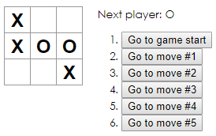

# Tic Tac Toe
**Tic Tac Toe game created using react following the react official tutorial [here](https://reactjs.org/tutorial/tutorial.html)**

Features:
- Alternating inputs 'X' and 'O'
- Logic to calculate the winner of a tic-tac-toe game
- Ignoring further clicks if a winner has been determined
- Game history time-travel

Some concepts learned and applied include:
- Passing data through props (creating controlled components
- Immutability of states for undo-redo operations
- Functional components

{style="float: right;"}
